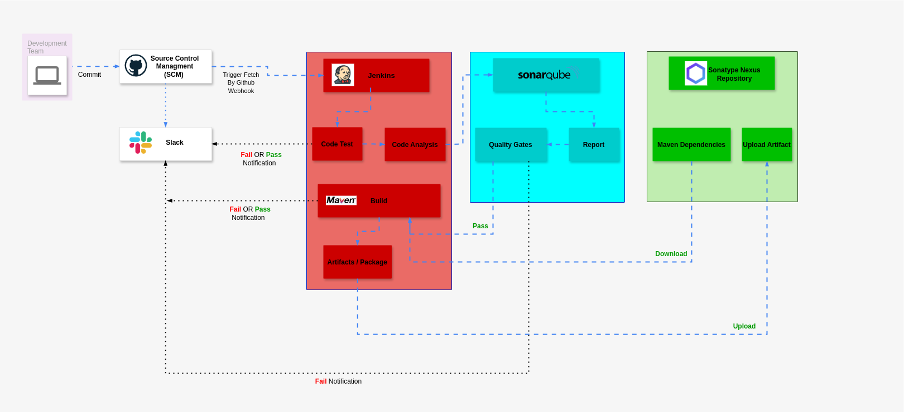

# Jenkins Pipeline

This repository contains a Jenkins pipeline configuration for building, testing, and deploying a Java application.

## Pipeline Diagram

## Pipeline Stages

1. **Build**: 
    - Installs dependencies from Nexus using Maven.
    - Archives the built `.war` files.

2. **UploadArtifact**:
    - Uploads the built artifact to Nexus Repository.

3. **Post Actions**:
    - Sends a Slack notification with the build result.

## Environment Variables

The following environment variables are used in the pipeline:

- `NEXUS_URL`: URL of the Nexus server.
- `NEXUS_REPOSITORY_SNAPSHOT`: Nexus snapshot repository.
- `NEXUS_REPOSITORY_RELEASE`: Nexus release repository.
- `NEXUS_REPOSITORY_GROUP`: Nexus group repository.
- `NEXUS_REPOSITORY_CENTRAL`: Nexus central repository.
- `NEXUS_USERNAME`: Nexus username.
- `NEXUS_PASSWORD`: Nexus password.
- `SONARQUBE_SERVER`: SonarQube server URL.
- `SONARQUBE_SCANNER`: SonarQube scanner name.

## Notifications

The pipeline sends a Slack notification to the specified channel with the build result.

## Usage

To use this pipeline, ensure that the following tools are configured in Jenkins:

- Maven (`MAVEN3`)
- JDK (`OracleJDK17`)

